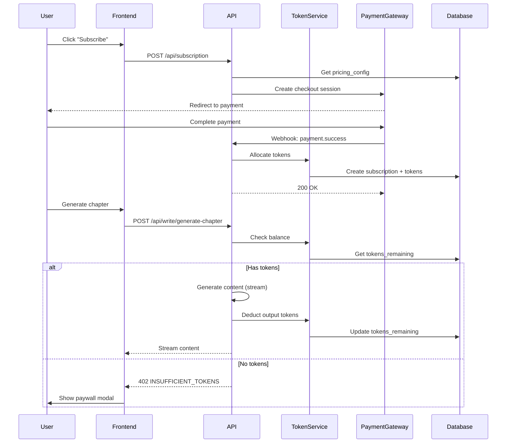

# Hemmi AI Payment & Subscription System

## Architecture Overview

```mermaid
flowchart TB
    subgraph Frontend [Frontend Layer]
        PricingPage[Pricing Page]
        PaywallModal[Paywall Modal]
        TokenDisplay[Token Balance Display]
        CheckoutFlow[Checkout Flow]
    end

    subgraph API [API Layer]
        PaystackWebhook[/api/webhooks/paystack]
        StripeWebhook[/api/webhooks/stripe]
        SubscriptionAPI[/api/subscription]
        TokenAPI[/api/tokens]
    end

    subgraph Services [Service Layer]
        PaymentService[Payment Service]
        TokenService[Token Service]
        SubscriptionService[Subscription Service]
    end

    subgraph Database [Supabase Database]
        PricingConfig[pricing_config]
        Subscriptions[subscriptions]
        TokenUsage[token_usage]
        PaymentHistory[payment_history]
    end

    subgraph External [Payment Gateways]
        Paystack[Paystack NGN/USD]
        Stripe[Stripe International]
    end

    PricingPage --> CheckoutFlow
    CheckoutFlow --> PaymentService
    PaymentService --> Paystack
    PaymentService --> Stripe
    Paystack --> PaystackWebhook
    Stripe --> StripeWebhook
    PaystackWebhook --> SubscriptionService
    StripeWebhook --> SubscriptionService
    SubscriptionService --> Subscriptions
    TokenService --> TokenUsage
    TokenDisplay --> TokenAPI
    PaywallModal --> CheckoutFlow
```

---

## Phase 1: Database Schema

Create new Supabase migration with these tables:

### 1.1 `pricing_config` - Configurable Pricing (Admin Adjustable)

```sql
-- Stores all adjustable pricing parameters
CREATE TABLE pricing_config (
  id UUID PRIMARY KEY DEFAULT gen_random_uuid(),
  key TEXT UNIQUE NOT NULL,           -- e.g., 'tokens_per_10_usd', 'basic_monthly_tokens'
  value JSONB NOT NULL,               -- flexible value storage
  description TEXT,
  updated_at TIMESTAMPTZ DEFAULT NOW(),
  updated_by UUID REFERENCES auth.users(id)
);

-- Default values to insert:
-- tokens_per_10_usd: 2000
-- tokens_per_10000_ngn: 2000
-- basic_monthly_tokens: 50000
-- plus_monthly_tokens: 150000
-- pro_monthly_tokens: 500000
-- basic_price_usd: 12, basic_price_ngn: 18000
-- plus_price_usd: 20, plus_price_ngn: 30000
-- pro_price_usd: 32, pro_price_ngn: 48000
```

### 1.2 `subscriptions` - User Subscriptions

```sql
CREATE TABLE subscriptions (
  id UUID PRIMARY KEY DEFAULT gen_random_uuid(),
  user_id UUID NOT NULL REFERENCES auth.users(id) ON DELETE CASCADE,

  -- Plan Info
  plan_type TEXT NOT NULL CHECK (plan_type IN ('basic', 'plus', 'pro', 'one_time')),
  billing_cycle TEXT CHECK (billing_cycle IN ('monthly', 'quarterly', 'yearly')),

  -- Token Allocation
  token_allocation INTEGER NOT NULL,      -- tokens allocated this period
  tokens_remaining INTEGER NOT NULL,      -- current balance

  -- Payment Info
  currency TEXT NOT NULL CHECK (currency IN ('NGN', 'USD')),
  amount_paid DECIMAL(12, 2) NOT NULL,
  payment_gateway TEXT NOT NULL CHECK (payment_gateway IN ('paystack', 'stripe')),
  gateway_subscription_id TEXT,           -- for recurring payments
  gateway_customer_id TEXT,

  -- Status
  status TEXT NOT NULL DEFAULT 'active' CHECK (status IN ('active', 'cancelled', 'expired', 'past_due')),

  -- Dates
  current_period_start TIMESTAMPTZ NOT NULL DEFAULT NOW(),
  current_period_end TIMESTAMPTZ NOT NULL,
  cancelled_at TIMESTAMPTZ,

  created_at TIMESTAMPTZ NOT NULL DEFAULT NOW(),
  updated_at TIMESTAMPTZ NOT NULL DEFAULT NOW(),

  CONSTRAINT one_active_subscription UNIQUE (user_id) WHERE status = 'active'
);
```

### 1.3 `token_usage` - Usage History

```sql
CREATE TABLE token_usage (
  id UUID PRIMARY KEY DEFAULT gen_random_uuid(),
  user_id UUID NOT NULL REFERENCES auth.users(id) ON DELETE CASCADE,
  subscription_id UUID REFERENCES subscriptions(id) ON DELETE SET NULL,
  project_id UUID REFERENCES writing_projects(id) ON DELETE SET NULL,

  -- Usage Details
  operation_type TEXT NOT NULL,           -- 'research', 'structure', 'chapter', 'chat', etc.
  tokens_used INTEGER NOT NULL,
  tokens_before INTEGER NOT NULL,
  tokens_after INTEGER NOT NULL,

  -- Context
  metadata JSONB,                         -- chapter name, word count, etc.

  created_at TIMESTAMPTZ NOT NULL DEFAULT NOW()
);

CREATE INDEX idx_token_usage_user ON token_usage(user_id, created_at DESC);
```

### 1.4 `payment_history` - All Transactions

```sql
CREATE TABLE payment_history (
  id UUID PRIMARY KEY DEFAULT gen_random_uuid(),
  user_id UUID NOT NULL REFERENCES auth.users(id) ON DELETE CASCADE,
  subscription_id UUID REFERENCES subscriptions(id) ON DELETE SET NULL,

  -- Transaction Details
  transaction_id TEXT NOT NULL UNIQUE,    -- gateway transaction ID
  payment_gateway TEXT NOT NULL,
  amount DECIMAL(12, 2) NOT NULL,
  currency TEXT NOT NULL,

  -- Token Purchase
  tokens_purchased INTEGER NOT NULL,
  payment_type TEXT NOT NULL CHECK (payment_type IN ('subscription', 'one_time', 'top_up', 'renewal')),

  -- Status
  status TEXT NOT NULL CHECK (status IN ('pending', 'success', 'failed', 'refunded')),
  failure_reason TEXT,

  -- Gateway Response
  gateway_response JSONB,

  created_at TIMESTAMPTZ NOT NULL DEFAULT NOW()
);
```

---

## Phase 2: Payment Services

### 2.1 Paystack Integration

Create `lib/services/paystackService.ts`:

- Initialize subscription checkout
- Verify transactions
- Handle webhook signatures
- Support both NGN and USD transactions

### 2.2 Stripe Integration

Create `lib/services/stripeService.ts`:

- Create checkout sessions
- Handle subscription management
- Process webhooks
- Support international cards

### 2.3 Unified Payment Service

Create `lib/services/paymentService.ts`:

- Route to correct gateway based on currency/location
- Abstract payment operations
- Handle token allocation after successful payment

---

## Phase 3: Token Management

### 3.1 Token Service

Create `lib/services/tokenService.ts`:

```typescript
// Key functions:
- getUserTokenBalance(userId): Promise<{ tokens: number, subscription: Subscription }>
- deductTokens(userId, amount, operation, metadata): Promise<boolean>
- hasEnoughTokens(userId, estimatedTokens): Promise<boolean>
- getTokenPricing(): Promise<PricingConfig>
- calculateTokensForPayment(amount, currency): number
```

### 3.2 Token Middleware

Create `lib/middleware/tokenMiddleware.ts`:

- Wrap AI generation endpoints
- Check token balance before generation
- Deduct OUTPUT tokens after generation completes
- Return error if insufficient tokens

---

## Phase 4: API Endpoints

### 4.1 Webhook Endpoints

- `app/api/webhooks/paystack/route.ts` - Handle Paystack events
- `app/api/webhooks/stripe/route.ts` - Handle Stripe events

### 4.2 Subscription Endpoints

- `app/api/subscription/route.ts` - GET current subscription, POST create checkout
- `app/api/subscription/cancel/route.ts` - Cancel subscription
- `app/api/subscription/top-up/route.ts` - One-time token purchase

### 4.3 Token Endpoints

- `app/api/tokens/route.ts` - GET balance
- `app/api/tokens/usage/route.ts` - GET usage history

---

## Phase 5: Frontend Components

### 5.1 Update Pricing Page

Modify [app/pricing/page.tsx](app/pricing/page.tsx):

- Fetch prices from database (not hardcoded)
- Add currency toggle (NGN/USD)
- Connect "Get Started" buttons to checkout flow
- Add one-time payment option

### 5.2 Token Balance Display

Create `app/components/subscription/token-balance.tsx`:

- Show remaining tokens in header/sidebar
- Progress bar visualization
- Low token warning

### 5.3 Paywall Modal

Create `app/components/subscription/paywall-modal.tsx`:

- Triggered when tokens depleted
- Show subscription options
- One-time top-up option

### 5.4 Subscription Management

Create `app/components/subscription/subscription-status.tsx`:

- Current plan display
- Renewal date
- Cancel/upgrade options

---

## Phase 6: Access Control Integration

### 6.1 Modify AI Generation Routes

Update these routes to check tokens before/after generation:

- `app/api/write/research/route.ts`
- `app/api/write/structure/route.ts`
- `app/api/write/generate-chapter/route.ts`
- `app/api/write/generate/route.ts`
- `app/api/chat/route.ts`

### 6.2 Route Protection Pattern

```typescript
// Before generation:
const balance = await tokenService.getUserTokenBalance(userId);
if (balance.tokens <= 0) {
  return Response.json({ error: "INSUFFICIENT_TOKENS" }, { status: 402 });
}

// After generation (in stream completion):
await tokenService.deductTokens(userId, outputTokens, "chapter", {
  chapterName,
});
```

---

## Phase 7: Cron Jobs (Supabase)

### 7.1 Subscription Expiry Check

Create `supabase/migrations/XXXX_subscription_cron.sql`:

- Daily job to check expired subscriptions
- Mark expired subscriptions as 'expired'
- Reset tokens to 0 for expired users

---

## Phase 8: Location Detection

### 8.1 Currency Detection

Create `lib/utils/currencyDetection.ts`:

- Use free IP geolocation API (ip-api.com or similar)
- Default to NGN for Nigerian IPs, USD for others
- Allow manual currency override
- Store preference in user profile

---

## Data Flow Diagram



---

## Environment Variables Required

```env
# Paystack
PAYSTACK_SECRET_KEY=sk_live_xxx
PAYSTACK_PUBLIC_KEY=pk_live_xxx
PAYSTACK_WEBHOOK_SECRET=whsec_xxx

# Stripe
STRIPE_SECRET_KEY=sk_live_xxx
STRIPE_PUBLIC_KEY=pk_live_xxx
STRIPE_WEBHOOK_SECRET=whsec_xxx

# Optional: IP Geolocation
IPAPI_KEY=xxx (free tier available)
```

---

## Initial Pricing Configuration

Values to insert into `pricing_config`:

| Key | Value | Description |

| -------------------- | ------ | ----------------------------- |

| tokens_per_10_usd | 2000 | Tokens per $10 (one-time) |

| tokens_per_10000_ngn | 2000 | Tokens per ₦10,000 (one-time) |

| min_onetime_usd | 10 | Minimum one-time payment USD |

| min_onetime_ngn | 10000 | Minimum one-time payment NGN |

| basic_tokens | 50000 | Basic plan monthly tokens |

| plus_tokens | 150000 | Plus plan monthly tokens |

| pro_tokens | 500000 | Pro plan monthly tokens |

| basic_price_usd | 12 | Basic monthly USD |

| plus_price_usd | 20 | Plus monthly USD |

| pro_price_usd | 32 | Pro monthly USD |

| basic_price_ngn | 18000 | Basic monthly NGN |

| plus_price_ngn | 30000 | Plus monthly NGN |

| pro_price_ngn | 48000 | Pro monthly NGN |

*All values adjustable via database updates*

---

## Files to Create/Modify

**New Files:**

- `supabase/migrations/XXXX_payment_schema.sql`
- `lib/services/paystackService.ts`
- `lib/services/stripeService.ts`
- `lib/services/paymentService.ts`
- `lib/services/tokenService.ts`
- `lib/services/subscriptionService.ts`
- `lib/utils/currencyDetection.ts`
- `app/api/webhooks/paystack/route.ts`
- `app/api/webhooks/stripe/route.ts`
- `app/api/subscription/route.ts`
- `app/api/subscription/cancel/route.ts`
- `app/api/subscription/top-up/route.ts`
- `app/api/tokens/route.ts`
- `app/components/subscription/token-balance.tsx`
- `app/components/subscription/paywall-modal.tsx`
- `app/components/subscription/subscription-status.tsx`

**Modify:**

- `app/pricing/page.tsx` - Connect to payment flow
- `app/pricing/components/plan-card.tsx` - Add checkout button handlers
- `app/api/write/generate-chapter/route.ts` - Add token checking
- `app/api/write/research/route.ts` - Add token checking
- `app/api/write/structure/route.ts` - Add token checking
- `app/api/chat/route.ts` - Add token checking
- `lib/supabase/database.types.ts` - Regenerate types

See this too -- it will help with our pricing/token usage count:

**Basic Plan ($20/month)**

Ideal for writing essays and short articles, this plan gives you **125,000 words (approximately 165,000 tokens)** per month. It's a cost-effective choice with a conservative output for individual projects.

**Pro Plan ($35–$40/month)**

Designed for heavy users like students or researchers working on multiple long papers or a thesis. For this price, you get **500,000 words (approximately 665,000 tokens)** each month, representing a clear upsell for more serious writing needs.

**Premium Plan ($60–$80/month)**

Made for daily power users with unlimited writing in mind. It offers **unlimited words and tokens** under a fair use policy. In practice, this means very high daily soft limits (for example, 2–3 million tokens) before a system cooldown applies, making it effectively "unlimited" for even the most intensive writing workloads.

Remember this is adjustable from the database.